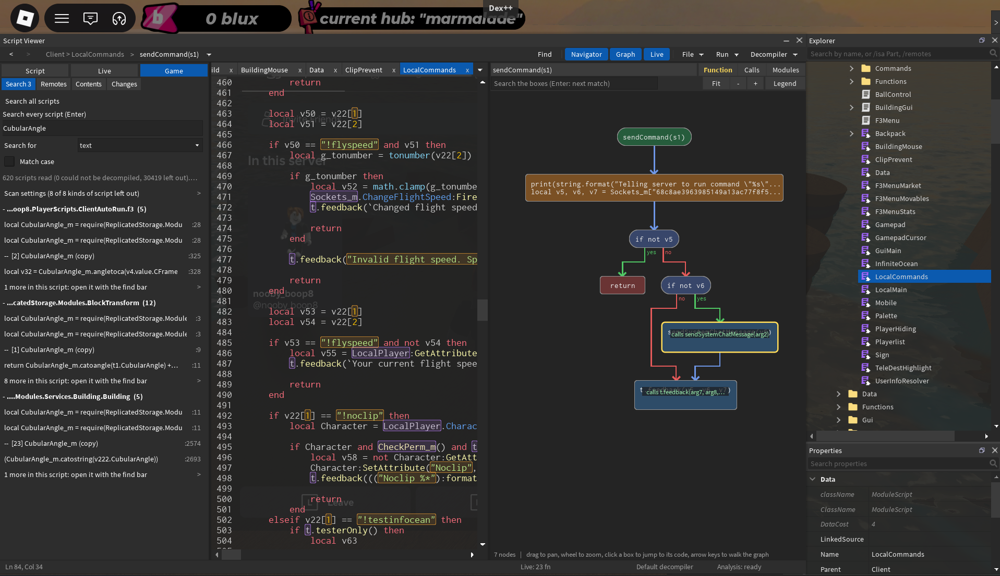

# OpenDex



OpenDex is an explorer and script reverse-engineering suite for Roblox that runs inside the game through an executor. Next to the usual Dex windows it has a Script Viewer that works like a code navigator: it parses the decompiled Luau, draws flowcharts, inspects and edits the running script, and searches every script of the game.

## Download

Get `out.lua` from the [latest release](https://github.com/dogmastr/OpenDex/releases/latest) and run it in your executor, or load it directly:

```lua
loadstring(game:HttpGet("https://github.com/dogmastr/OpenDex/releases/latest/download/out.lua"))()
```

## Features

### Script Viewer

- **Code navigation:** tabs, find, go to definition, find references and assignments, back and forward. All of it follows `require` into other modules.
- **Annotations:** rename locals, type a note on any line (click the line and type), and apply suggested names for `v12`-style variables. They are saved per script and survive a different decompile.
- **Instances:** what stands for an instance that is in the game (`game.ReplicatedStorage.Remotes`, `script.Parent`, `:WaitForChild("Gui")`) is underlined. Ctrl+click selects it in the Explorer.
- **Navigator sidebar:** the script's outline, callers and callees, and remote, HTTP and `loadstring` calls with resolved paths.
- **Graphs:** a flowchart of the function under the cursor, the script's call graph, and the modules around it. Click a box to jump to its code.
- **Live values:** constants and upvalues of the running script are outlined in the code. Hover one to read or change it, or pin it to the watch list.
- **Tracing:** log a function's arguments, return values and caller. A tracepoint can take a condition, force a return value or change arguments.
- **Runtime tools:** count which functions run, scan for where a value is kept, and open the value a module returned.
- **Search all scripts:** decompiles every script in the background and caches it. Search as text, whole word, Lua pattern, name, string, or a call such as `FireServer(Buy)`.
- **Game overview:** a remote map (who fires and who listens to each remote), scripts ranked by what they contain (remotes, HTTP, obfuscation), and a diff of what changed since your last session.
- **Decompilers:** the executor's own, or Konstant and Advanced Decompiler. Diff two decompiles, a snapshot, the previous version or another tab.

### Explorer and Properties

- Instance tree with current Studio icons and API. Search as you type, with filters such as `/isa Part`, `/remotes` and `/rad 50`.
- Cut, copy, paste, duplicate, group, rename and insert objects.
- **Copy as Code** writes the Luau that rebuilds an object: `Instance.new`, the properties that differ from a new one, attributes and tags.
- **Find in Scripts** searches every script for the object's name.
- Remotes: block from firing (a blocked remote is shown in red), find the calling script, see where the game's scripts use it.
- View connections, fire ClickDetectors, ProximityPrompts and TouchTransmitters, play tweens and animations, browse nil instances, click a part to select it.
- Properties filter as you type, with editors for enums, colours, sequences and attributes. Right-click a property to copy its value (as text or as code), its name or its path.

### Everything else

- **Console:** the game's output with a search box and a switch per kind of message, and a command box with history.
- **3D Viewer:** preview a model, accessory or folder.
- **Save Instance:** the executor's `saveinstance`, or USSI as the fallback.
- **Command palette** for every action, dockable windows with saved layouts, and touch support.

## Build

Run `python build.py` (Python 3). It joins `header.lua`, `modules/` and `main.lua` into `out.lua`, the file to run in your executor.

## Executor support

OpenDex starts with whatever the executor has. A feature it cannot run is greyed out and names the missing function.

| Feature | Functions |
|---|---|
| Viewing scripts | `decompile`, or `getscriptbytecode` for the other decompilers |
| Script cache and change tracking | `getscripthash`, `readfile`, `writefile`, `listfiles`, `delfile` |
| Live values | `getgc`, `getupvalues`, `getconstants`, `setupvalue`, `setconstant` |
| Tracing, blocking remotes | `hookfunction`, `hookmetamethod` |

## Files it writes

Everything goes in the executor's workspace folder.

| Path | What it holds |
|---|---|
| `OpenDexSettings.json` | The settings. |
| `dex/layout.json` | Where the windows were left, and what each one remembers: the Script Viewer's panes, the Console's text size and switches, Save Instance's options. |
| `dex/rbx_api.dat`, `dex/rbx_rmd.dat`, `dex/deps_version.dat` | Roblox's API dump and class metadata. Downloaded again when Roblox updates. |
| `dex/cache/` | Every script that was decompiled, by hash, and an index per place. A cached script opens without the decompiler. |
| `dex/annotations/` | Renames and notes, one file per script. |
| `dex/recent.json` | The scripts opened lately, per place. |
| `dex/plugins/` | Your plugins (see below). |

Save Instance and "Save script" write their files next to the `dex` folder. Deleting `dex` is safe: you lose the annotations and your plugins, and everything else is made again.

## Plugins

A Lua file in `dex/plugins` is loaded when OpenDex starts and gets a tile in its menu. The file returns a table:

- `InitDeps(data)` is called first with OpenDex's own tables: `Main`, `Lib` (the UI kit), `Apps` (the other windows, such as `Apps.Explorer`), `Settings`, `API`, `RMD`, `env` (the executor's functions; one the executor lacks is `nil`), `service` and `plr`.
- `Main()` returns the plugin. Its `Init()` runs once and has to set `Window`, a `Lib.Window`. If it has an `Unload()`, that runs before OpenDex reloads: undo there whatever the plugin hooked.
- `PluginData.FriendlyName` is the name on the tile.

```lua
-- dex/plugins/hello.lua
local Main, Lib

return {
	PluginData = {Name = "Hello", FriendlyName = "Hello"},

	InitDeps = function(data)
		Main, Lib = data.Main, data.Lib
	end,

	Main = function()
		local Hello = {}

		Hello.Init = function()
			local window = Lib.Window.new()
			window:SetTitle("Hello")
			window:Resize(220, 120)
			Hello.Window = window

			local button = Lib.Button.new()
			button.Text = "Say hello"
			button.Position = UDim2.new(0, 10, 0, 10)
			button.Size = UDim2.new(1, -20, 0, 22)
			button.OnClick:Connect(function()
				Main.Notify("Hello from a plugin", "success")
			end)
			window:Add(button)
		end

		return Hello
	end,
}
```

A plugin that does not load is named in a notification with its error, and OpenDex starts without it.

## Credits

Based on [Dex++](https://github.com/AZYsGithub/DexPlusPlus) by Chillz, which extends [Moon's Dex](https://github.com/LorekeeperZinnia/Dex). Uses Konstant, [Advanced Decompiler](https://github.com/w-a-e/Advanced-Decompiler-V3) and [USSI](https://github.com/luau/UniversalSynSaveInstance) as fallbacks.

Licensed under [MIT](./LICENSE).
